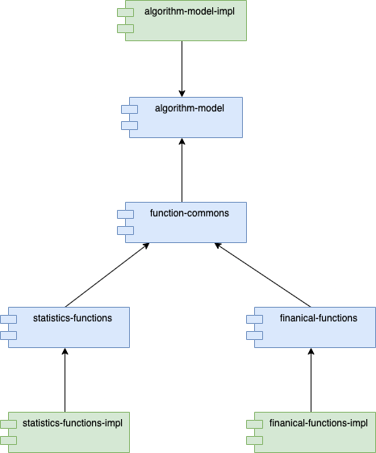

# Algorithm Microservices

The purpose of this entire project is to create an application that adheres to 
[SOLID](http://www.objectmentor.com/resources/articles/Principles_and_Patterns.pdf) 
principals as much as possible, as well as demonstrate how to create a collection of 
microservices that leverage our algorithm libraries using Java and Spring.

## The Algorithm Libraries

There are two _functional_ libraries:

- **Statistics**: Contains a collection of statistical functions including a linear regression
  model.

- **Financial**: Contains a collection of financial functions including models for 
  estimating 401(k) retirement (both contributions and distributions)

### Library Design

The libraries are designed around SOLID principals, meaning that the implementation is
separated from its interfaces, both logically and physically. This enables software 
to consume from the interface, while the implementation is abstracted away in a separate
jar.

Moreover, each of the functional libraries are packaged separately, allowing for software
to use only what it needs, rather than relying a monolithic collection of code that 
won't be used. That said, both of the libraries share a common "model", which are interfaces
that define a `Parameter`, `Coefficent`, `Function`, and `Model`, as well types of data with
`Scalar`<sup>[1]</sup>, `Vector` and `Matrix`.  By creating a separate set of interfaces for the model,
we can easily extend our code to create _new_ functional libraries in the future.

As a consequence, several design patterns are used that allow access to the underlying
implementation from the interfaces.

- **Service Pattern**: This is a pattern introduced by Java that uses the `java.util.ServiceLoader`
  to load implementations of a specified interface. 
- **Factory Pattern**: Factory methods are used to create instances of functions, models, parameters,
  coefficients and data structures.

## The Algorithm Projects

The two functional libraries are broken into 7 separate projects:

- [algorithm-model](./algorithm-model/README.md): Contains the interfaces that will be used by all functions
  and model implementations. It exposes a `ModelProvider` interface that is used as the access point 
  for concrete implementations via a **Service Pattern**.  The `ModelProvider` exposes four _factory_
  interfaces used to create `Parameter`, `Coefficient`, `Vector` and `Matrix` instances.
- [algorithm-model-impl](./algorithm-model-impl/README.md): This is a reference implementation of the 
  `algorithm-model` interfaces. 
- [function-commons](./function-commons/README.md): Are a set of common abstract classes used by 
  functions and models. In addition, it defines interfaces for a `FunctionProvider` and 
  `FunctionFactory` that specific function libraries must extend.  In essence, function-commons
  is a bridge between the model, and the functional libraries.
- [statistics-functions](./statistics-functions): Defines the interfaces for all statistical functions
  and extends the `FunctionFactory` and `FunctionProvider` interfaces from function-commons that
  provide an entry point into the library.
- [statistics-functions-impl](./statistics-functions-impl): This is the concrete implementation of 
  the statistics-functions interfaces. 
- [financial-functions](./financial-functions): Defines interfaces for all financial functions, and,
  like statistics-functions, extends the `FunctionFactory` and `FunctionProvider` interfaces from
  function-commons to provide entry points into the functions.
- [financial-functions-impl](./financial-functions-impl): Concrete implementation of the financial-functions 
  interfaces.

### Dependency Graph

The following diagram shows the dependency graph



### Using the libraries

To use either of the functional libraries, you only need to include the _implementation_ jars
for the algorithm-model and the specific functional library you want to use.  For example,
if you want to use the statistics library you would add the following to your dependencies:

* Note: I'm using property interpolation here as generic way of defining the artifact version.

**Maven**
```xml
<dependencies>
  <dependency>
    <groupId>io.xmljim.algorithms</groupId>
    <artifactId>algorithm-model-impl</artifactId>
    <version>${algorithm-model.version}</version>
  </dependency>
  <dependency>
    <groupId>io.xmljim.algorithms.functions.statistics</groupId>
    <artifactId>statistics-functions-impl</artifactId>
    <version>${statistics-functions.version}</version>
  </dependency>
</dependencies>
```

**Gradle**

```kotlin
dependencies {
    implementation("io.xmljim.algorithms:algorithm-model-impl:$algorithm-model.version")
    implementation("io.xmljim.algorithms.functions.statistics:statistics-functions-impl:$statistics-model.version")
}
```

Since the dependencies already include the interfaces, these will be included by default.


## The Retirement Calculator

As a reference implementation of the algorithm libraries, I've created a set of microservices that 
work together to define a retirement calculator.  Each microservice defines a set of
endpoints that perform specific operations.

This application leverages several key components from Spring:

- Spring Web MVC
- Spring Netflix Eureka - for service discovery and registration
- Spring Config - for centralized configuration
- Spring API Gateway for creating a core set of endpoints and a homogeneous API from our microservices
- Spring Security
- Spring JPA - for storing stock and CPI data
- Spring Hystrix
- Spring Resilience4J


---
[1] Scalar _isn't_ an interface, but it is a `final` class that extends `Number`, and includes several
    static methods for creating instances.

